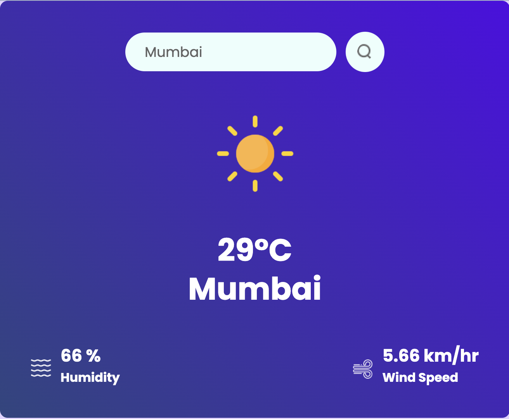

# Weather App 🌦️

A simple and fast weather application built using **React** with **Vite** for bundling and development. It fetches real-time weather information based on the city name using the **OpenWeather API**.

## Features
- Fetches **current weather** data by city name.
- Displays:
  - Temperature
  - Humidity
  - Wind speed
  - Weather description (e.g., Clear, Rain, Clouds)
- Clean, responsive design for both desktop and mobile users.

## Technologies Used
- **React**: JavaScript library for building the user interface.
- **Vite**: Next-generation frontend tooling for fast development and build.
- **OpenWeather API**: External API used for fetching weather data.
- **CSS**: For styling the application.

## Demo

### [http://localhost:5173/](#) 🔗 (link to your hosted app)

## Usage
Enter the name of a city in the search bar.  
Press Enter or click the search button to fetch and display the weather details for that city.   
## API
This project uses the OpenWeather API. You can get your free API key by signing up at OpenWeather.  

## Project Structure
├── public   ├── src   &nbsp;│ ├── components    &nbsp;│ ├── App.jsx   &nbsp;│ ├── index.jsx   &nbsp;│ └── ...   ├── .env   ├── package.json   ├── vite.config.js  └── README.md  

